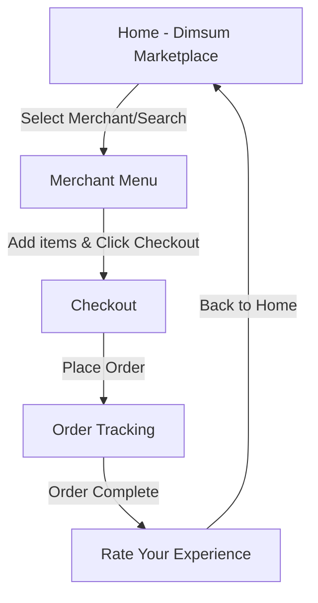

# Product Requirements Document (PRD)
## Dimsum Nuraos Xpress (Expo Mobile Application)

| Metadata | Value |
| :--- | :--- |
| **Project Title** | Dimsum Nuraos Xpress Mobile App |
| **Target Platform** | iOS & Android (Cross-platform) |
| **Framework Stack** | React Native, Expo (TypeScript) |
| **Stitch Project ID**| `1081428596892273292` |
| **Status** | Approved & Ready for Implementation |
| **Version** | v1.0.0 |

---

## 1. Executive Summary & Product Vision

**Dimsum Nuraos Xpress** is a high-speed, mobile-first marketplace that connects dimsum enthusiasts with local artisanal merchants. The product's core promise is **rapid delivery of piping-hot dimsum** from bamboo steamer to doorstep, combining high culinary quality with bullet-train efficiency (inspired by the Shinkansen motif).

The mobile application must provide a warm, premium, and highly responsive shopping experience that translates beautiful, modern visual styles (curated HSL palettes, warm organic shadows, and rich micro-interactions) into a fluid React Native implementation.

---

## 2. Brand Identity & Design Token System

To maintain absolute fidelity with the **Dimsum Nuraos Design System**, the Expo application will utilize a custom theme matching the following tokens:

### 2.1 Color Palette
```typescript
export const DimsumPalette = {
  // Brand & Action Colors
  primary: '#d35400',          // Terracotta Burnt Orange (Hot & Fresh dimsum action focus)
  primaryContainer: '#c64f00',
  secondary: '#75584d',        // Bamboo Wood Brown
  secondaryContainer: '#fed7ca',
  tertiary: '#71582c',         // Steam Cream Warm Accent
  tertiaryContainer: '#8c7042',

  // Surfaces & Backgrounds
  background: '#f7f9ff',       // Crisp Warm Light Blue-tinted Off-White
  surface: '#f7f9ff',
  surfaceBright: '#f7f9ff',
  surfaceDim: '#c9dcf3',       // Shaded Surface Depth
  surfaceContainerLowest: '#ffffff',
  surfaceContainerLow: '#edf4ff',
  surfaceContainer: '#e3efff',
  surfaceContainerHigh: '#d9eaff',
  surfaceContainerHighest: '#d1e4fb',

  // Text & Outlines
  onBackground: '#091d2e',     // Charcoal-Navy deep text color
  onSurface: '#091d2e',
  onSurfaceVariant: '#594238',  // Subtext warm brown
  outline: '#8c7166',          // Thin border bamboo color
  outlineVariant: '#e0c0b2',   // Light border bamboo color

  // System & Alert
  error: '#ba1a1a',
  onError: '#ffffff',
  errorContainer: '#ffdad6',
  onSecondaryFixedVariant: '#5b4137',
  tertiaryFixed: '#ffdeaa',
};
```

### 2.2 Typography Hierarchy
The app will load and utilize two custom font families:
*   **Plus Jakarta Sans**: Used for titles, headers, navigation labels, and brand highlights. Evokes a sleek, geometric, modern feeling.
*   **Be Vietnam Pro**: Used for body descriptions, menu descriptions, and long-form inputs. Humanist and highly legible.

| Token | Family | Size (px) | Weight | Line Height | Letter Spacing |
| :--- | :--- | :--- | :--- | :--- | :--- |
| **Headline XL** | Plus Jakarta Sans | 40px | 700 (Bold) | 48px | -0.02em |
| **Headline LG** | Plus Jakarta Sans | 32px | 700 (Bold) | 40px | -0.01em |
| **Headline MD** | Plus Jakarta Sans | 24px | 600 (Semibold)| 32px | Normal |
| **Label MD** | Plus Jakarta Sans | 14px | 600 (Semibold)| 16px | Normal |
| **Label SM** | Plus Jakarta Sans | 12px | 500 (Medium) | 14px | Normal |
| **Body LG** | Be Vietnam Pro | 18px | 400 (Regular) | 28px | Normal |
| **Body MD** | Be Vietnam Pro | 16px | 400 (Regular) | 24px | Normal |
| **Body SM** | Be Vietnam Pro | 14px | 400 (Regular) | 20px | Normal |

### 2.3 Shapes & Elevation
*   **Global Corner Radius**: A standard `16px` (`borderRadius.lg` or `24px` for large cards/modals) will be used to keep elements soft, appealing, and circular—mimicking dumplings and bamboo steamer lids.
*   **Interactive Radius**: Buttons, quantity pill selectors, and promotional chips use a fully rounded/pill layout (`borderRadius: 9999px`).
*   **Depth (Tonal & Shadow)**: Drop shadows must not use pure black. They should be tinted with the terracotta primary color: `rgba(211, 84, 0, 0.08)` for regular elements, and `rgba(211, 84, 0, 0.16)` for floating modals and sticky bars, creating a soft, warm "glow."

---

## 3. Product Features & Detailed Screen Specifications

The app flow comprises 6 main functional screen states matching the Stitch design assets.



---

### 3.1 Screen 1: Home (Dimsum Marketplace Discovery)
**Stitch ID**: `2b2b59ab5cec46b990b1248a30f1ab6f`

*   **Objective**: Allow users to explore promos, search for products, view best sellers, and find nearby merchants.
*   **Key Features**:
    1.  **Top App Bar**: Custom component with a hamburger menu button, a centered logo combining "Dimsum Nuraos" in Plus Jakarta Sans bold with an aerodynamic Shinkansen "Xpress" logo asset, and the user's rounded avatar on the right.
    2.  **Interactive Search**: Features a magnifying glass icon, a search placeholder ("Craving Dimsum? Search here..."), and a tuning icon on the right to open quick filter sheets.
    3.  **"Hot Steaming Deals" (Promo Carousel)**: Horizontal scroll cards displaying promotional banners (e.g. "Discount 20% on Chicken Dimsum", "Premium Shrimp Siomay"). Backgrounds utilize rich high-key dimsum photography overlaid with terracotta tags ("LIMITED OFFER", "NEW ARRIVAL").
    4.  **"Best Sellers" Carousel**: Horizontal scroll of individual items (e.g. *Siomay Ayam Special*, *Hakau Udang*). Cards feature floating star rating badges (e.g. `4.9`), truncated merchant subtitles, terracotta prices, and a secondary-container rounded `+` button.
    5.  **Nearby Merchants (Bento Layout)**:
        *   *Hero Merchant Card*: Highlights the premium flagship merchant "Dimsum Nuraos Xpress" with a detailed card. Contains merchant image, star rating banner (`4.8`), favorite badge, brief description, descriptive tags ("Fast Delivery", "HALAL", "Authentic"), distance tracker ("0.8 km away"), and a prominent terracotta "Order Now" button.
        *   *Secondary Merchants Grid*: 2-column or list view of secondary merchants (e.g. *Hao Chi Dimsum*, *Golden Steam*) with thumbnail, ratings, price tiers, and delivery badges.
    6.  **Navigation & FAB**:
        *   Sticky floating action button (FAB) on the bottom right (steamer basket icon) representing a quick action (e.g., "Open Nearest Steamer").
        *   Bottom Tab Nav bar: Standardized 4-icon menu: **Home (active)**, **Orders**, **Cart**, **Profile** with comfortable tap areas.

---

### 3.2 Screen 2: Merchant Menu (Updated Profile)
**Stitch ID**: `6ca9a59670234047a262a25435b74e62`

*   **Objective**: Show a detailed merchant store page, grouping menu items into tabs, with an instant transaction bottom drawer.
*   **Key Features**:
    1.  **Hero Cover Image**: Generous high-quality top-down view of steaming dimsum baskets. Includes a dark overlay at the bottom with white text showing the merchant name "Dimsum Nuraos", rating average, review counts ("4.8 (2k+ reviews)"), and expected delivery timeframe ("15-25 min").
    2.  **Sticky Category Navigation**: Smooth horizontal scrollbar with pill-shaped tabs: **Signature (active)**, **Frozen Packs**, **Beverages**. Tapping a tab animates the scroll position of the menu below.
    3.  **"Signature Flavors" Menu Grid**:
        *   Display lists of delicious steam-basket offerings: *Ayam (Chicken)*, *Beef*, *Udang (Shrimp)*, *Keju (Cheese)*.
        *   Each item is a card with a delicate light-bamboo border (`#EEDDC3`).
        *   Includes a small thumbnail image, the item's name with Chinese translation (e.g. `Ayam (鸡)`), price (`Rp 25.000`), short description, and a terracotta `+` (Add to Cart) action button.
    4.  **"Frozen Packs" Section**:
        *   Bento-style layout grouping high-value bundle items (e.g., *Family Bundle Pack - 24 pcs* at `Rp 145.000`) alongside individual frozen bags with a cooling icon.
    5.  **Sticky Transaction Drawer**:
        *   Floating transactional bar anchored at the bottom right above the bottom nav.
        *   Displays active items count, running subtotal price (`Rp 25.000`), and a prominent "Checkout" button that slides in with a spring animation when an item is added.

---

### 3.3 Screen 3: Checkout
**Stitch ID**: `fffaebe479154cba9e1c91c40949e3b7`

*   **Objective**: Finalize delivery details, payment methods, and place order.
*   **Key Features**:
    1.  **Transactional Header**: Centered "Xpress Logo" with a back navigation arrow on the left and the user's avatar on the right.
    2.  **Delivery Address & Mini-Map**:
        *   Address indicator showing location title ("Home") and full text ("Jl. Mawar Indah No. 42, Kebayoran Lama, Jakarta Selatan...").
        *   Interactive Mini Map widget displaying a stylized, cream-and-terracotta street map centered at the user's pin with a bouncing delivery pin.
    3.  **Order Summary**: Scrollable list of items currently in the cart with thumbnail images, quantity count, and total item prices.
    4.  **Payment Method Selector**: Multi-option accordion/radio options:
        *   *E-wallet (Active)*: Displays current digital balance ("OVO/GoPay Balance: Rp 150.000") with a primary terracotta check badge.
        *   *Credit Card*: Input card mask displaying final four digits.
        *   *Cash on Delivery*: Fallback cash option.
    5.  **Totals Breakdown**: Clean list breakdown specifying Subtotal, Delivery Fee (`Rp 12.000`), Server Fee (`Rp 2.500`), and a bold final **Total Amount** (`Rp 88.500`).
    6.  **Bottom Action Drawer**: Sticky panel showing Total Payment, Applied Promo Tag, and a high-emphasis **"Place Order"** button complete with a rocket ship icon and shadow glow.

---

### 3.4 Screen 4: Order Tracking
**Stitch ID**: `4b908d16651243d7835b936054273b58`

*   **Objective**: Show live status updates of the delivery with real-time geographic simulation.
*   **Key Features**:
    1.  **Header**: Simplified bar displaying "Track Order" with a back button.
    2.  **Live Map Canvas**:
        *   Full-screen map using `react-native-maps` stylized with a warm cream/light-blue scheme.
        *   Markers:
            *   *Merchant Pin*: "Dimsum Nuraos" with a restaurant food basket icon.
            *   *User Pin*: "Your Home" with a deep charcoal house marker.
            *   *Driver Pin (Budi)*: Active motorcycle marker surrounded by a pulsing terracotta ring (`pulse-marker`) indicating motion.
        *   *Path Line*: Dashed SVG route linking the merchant to the driver, and the driver to the user home.
    3.  **Floating Driver Status Card**:
        *   Anchored card at the bottom featuring a clean partition line.
        *   Top part displays **Estimated Arrival (ETA)**: `12 mins` with a warm cream-colored timer badge.
        *   Bottom part displays driver profile details: Driver picture, name ("Budi"), license plate number ("T 1987 BC"), and current status ("Driver is picking up your dimsum").
        *   Includes two tactile interactive actions: **Chat** (active orange primary action) and **Call** (outlined).

---

### 3.5 Screen 5: Rate Your Experience (Post-Order Completion)
**Stitch ID**: `f381384927bf46c5b1d5083c628021f2`

*   **Objective**: Celebrate successful delivery, gather feedback, and offer tip options.
*   **Key Features**:
    1.  **Celebration Hero Section**:
        *   Top header titled "Order Details".
        *   Artisanal illustration of a steaming bamboo steamer overflowing with fresh dumplings.
        *   Aerodynamic "Xpress Logo" positioned right above a bright title: **"Enjoy your dimsum!"** and subtext: *"Your order from Dimsum Nuraos has arrived fresh and hot."*
    2.  **Dual Rating System**:
        *   *Merchant Rating*: 5-star interactive rating row next to a store icon labeled "Dimsum Nuraos".
        *   *Driver Rating*: 5-star interactive rating row next to a delivery rider icon labeled "Dimsum Nuraos Driver".
        *   *Feedback Textarea*: Soft-grey container input for written reviews.
    3.  **Driver Tipping Panel**:
        *   Grid of tipping buttons: `Rp 2.000`, `Rp 5.000`, and `Custom`. Selection toggles high-contrast terracotta colors.
    4.  **Primary CTA**: High-emphasis **"Back to Home"** terracotta button to complete the flow and return the user to the Marketplace.

---

## 4. Technical Architecture (Expo Mobile Implementation)

The application will be built using modern Expo features, ensuring full native compatibility with maximum web-like styling ease.

### 4.1 Navigation Structure (Expo Router)
The application will leverage Expo Router's file-based layout:

```text
app/
├── (tabs)/                # Main Tab Navigation
│   ├── _layout.tsx        # Bottom Tab Bar setup (Home, Orders, Cart, Profile)
│   ├── index.tsx          # Home Screen (Marketplace Discovery)
│   ├── orders.tsx         # Orders History Screen
│   ├── cart.tsx           # Cart Management Screen
│   └── profile.tsx        # Profile Management Screen
├── merchant/
│   └── [id].tsx           # Merchant Menu (Dynamic Storefront)
├── checkout/
│   └── index.tsx          # Checkout Screen
├── tracking/
│   └── [orderId].tsx      # Live Order Tracking Map Screen
├── rate/
│   └── [orderId].tsx      # Post-Order Rating and Tipping Screen
├── _layout.tsx            # Global state wrappers, Fonts & Theme setup
```

### 4.2 State Management: Zustand (Cart & Delivery State)
A lightweight state store is recommended to manage the active shopping basket and order lifecycle.

```typescript
import { create } from 'zustand';

interface CartItem {
  id: string;
  name: string;
  price: number;
  quantity: number;
  image: string;
}

interface DimsumStore {
  cart: CartItem[];
  currentOrder: {
    id: string | null;
    status: 'idle' | 'preparing' | 'shipping' | 'delivered';
    eta: number; // minutes
  };
  addToCart: (item: Omit<CartItem, 'quantity'>) => void;
  removeFromCart: (itemId: string) => void;
  clearCart: () => void;
  placeOrder: () => void;
  updateOrderStatus: (status: 'preparing' | 'shipping' | 'delivered') => void;
}
```

### 4.3 Key Dependencies
The following dependencies should be set up in `package.json`:
*   `expo-router`: File-based navigation.
*   `expo-font` & `@expo-google-fonts/plus-jakarta-sans` & `@expo-google-fonts/be-vietnam-pro`: Custom fonts loading.
*   `react-native-maps`: For native map rendering on Checkout and Order Tracking screens.
*   `react-native-reanimated`: For micro-interactions (e.g. spring scales on "Add" button click, bouncing markers).
*   `lucide-react-native`: For clean, rounded icons matching the typography.

---

## 5. Non-Functional Requirements & UX Flow Checklist

To achieve a **Premium/WOW** status, the implementation must respect several micro-UX details:

1.  **Haptic Feedback**: Add brief haptic taps (`expo-haptics`) when users:
    *   Tap the "Add to Cart" (+) button.
    *   Place their order.
    *   Tap stars in the rating experience.
2.  **App Load/Splash Screen**: Displays a beautiful terracotta splash screen with the aerodynamic bullet-train "Xpress" logo before loading the app fonts.
3.  **Skeleton Loaders**: Avoid blank screens. Banners, best sellers, and merchant cards should display shimmering grey-orange placeholders during network simulation.
4.  **Transition Animations**: Page transitions (especially navigating from Checkout to Tracking, and Tracking to Review) must use smooth slide/fade-in animations via React Native Reanimated.

---

## 6. Verification & Launch Plan

### 6.1 Automated Tests
*   **Unit Tests**: Verify cart arithmetic (subtotals, coupon deductions, delivery calculations) via Jest.
*   **Component Tests**: Ensure typography families match designated design tokens.

### 6.2 Manual Review Points
*   **Color Check**: Match actual HSL values under both light and simulated dark OS settings.
*   **Map Responsiveness**: Ensure route maps scale correctly on both small iOS devices (SE) and large Android tablets.
